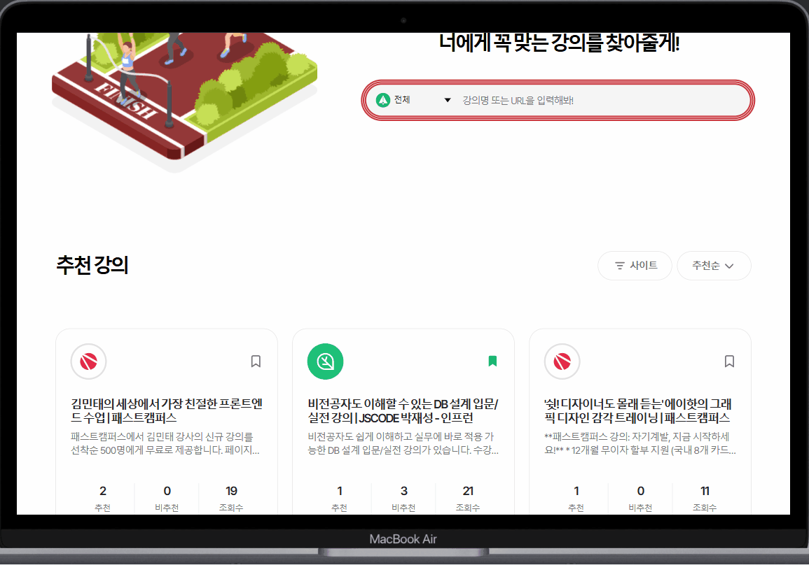
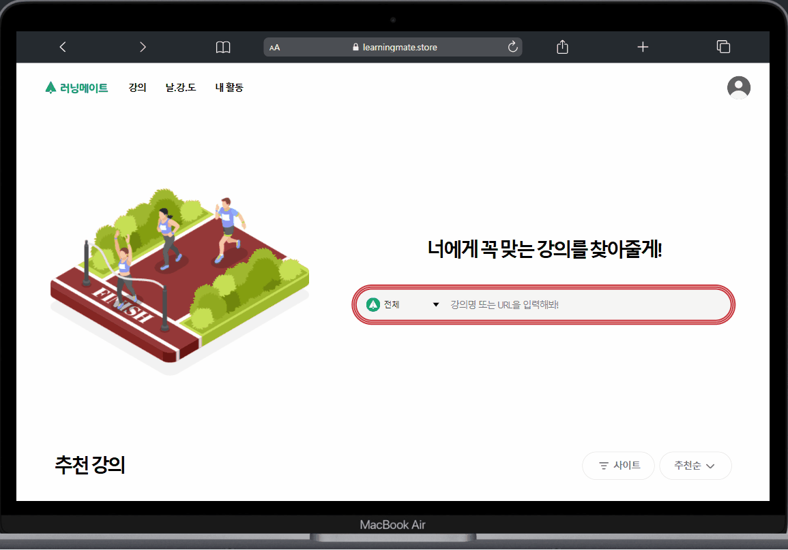
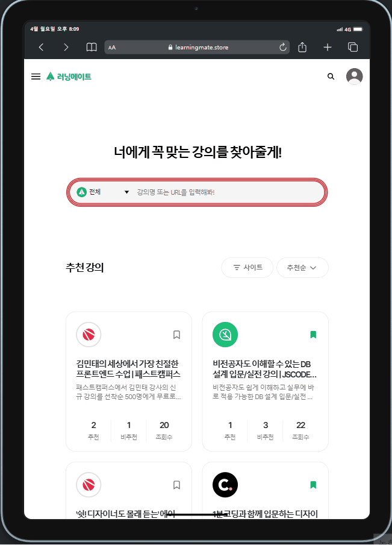

# 🎓 러닝메이트 (LearningMate)

## [🌐 데모 사이트 바로가기](https://learningmate.store)

**러닝메이트**는 추천 평가를 기반으로 나에게 꼭 맞는 강의를 연결해주는 서비스입니다.  
수강자는 다양한 평가를 참고해 강의를 선택하고,  
강사는 수요에 맞는 콘텐츠를 기획할 수 있는 **연결 중심의 서비스**입니다.

---

## 📚 About the Project

**러닝메이트**는 팀 프로젝트로 진행된 강의 추천 플랫폼으로,  
**프론트엔드 개발, 사용자 경험 개선, 퍼포먼스 최적화, CI/CD 구축** 등  
다양한 실무 기술을 적용한 프로젝트입니다.

### 주요 목표

- 사용자가 **강의 추천 및 탐색**을 쉽게 할 수 있도록 구현
- JWT 인증, API 역할 분리, 무한스크롤 등 **실무 중심의 구조 설계**
- 성능 최적화 및 배포 자동화로 **제품 완성도 향상**

---

## ✨ Features

- **JWT 인증 및 보안 처리**

  - Axios 요청 인터셉터 활용, JWT 토큰 자동 포함
  - accessToken / refreshToken 관리 및 HttpOnly 쿠키 사용

- **이메일 인증 기능**

  - Firebase Cloud Functions를 이용한 이메일 인증 코드 발송 및 유효성 검사

- **회원가입 & 로그인 유효성 검사**

  - React Hook Form 기반 실시간 폼 유효성 검사 및 UX 개선

- **API 관리 및 비즈니스 로직 분리**

  - custom hook으로 API 호출 로직 분리
  - useQuery, useMutation 활용하여 역할별 모듈화

- **TanStack Query 기반의 상태 관리 최적화**

  - 낙관적 업데이트 적용
  - 무한 스크롤(Infinite Query)로 데이터 페칭 최적화

- **반응형 웹 구현**

  - Tailwind CSS로 디바이스별 반응형 UI 구성 (PC / 태블릿 / 모바일)

- **CI/CD 자동화**

  - GitHub Actions로 자동 빌드 & 배포 파이프라인 구축
  - AWS S3, Route 53, EC2, CloudFront로 도메인 연결 및 배포

- **최적화 작업**
  - Lighthouse 성능 점수 약 40% 향상
  - React.lazy와 Suspense로 페이지 코드 스플리팅
  - 에디터(lazy 컴포넌트) 분리
  - 검색 기능에 디바운스 적용 (0.5s)
  - useCallback, useMemo로 리렌더링 최소화
  - react-helmet-async로 SEO 메타 태그 설정

---

## 📸 Screenshots

### 강의 페이지(홈 페이지)

### 강의 상세 페이지

### 내 활동 페이지

### 날.강.도 페이지 (나를 위한 강의 도우미)

### 마이페이지 / 회원가입 페이지

### 반응형 디자인

#### 태블릿

#### 모바일

## 🛠️ Tech Stack

- **Frontend:** React, TypeScript, HTML/CSS
- **State Management:** Zustand, Tanstack Query
- **Routing:** React Router
- **Styling:** Tailwind CSS
- **Deployment:** AWS S3, EC2, Route 53, CloudFront
- **CI/CD:** GitHub Actions
- **Etc:** Swagger, Firebase (이메일 인증), 피그마 협업

---

## 👥 팀 구성 (4인)

- 역할: **프론트엔드 전담**
- 기획자 / 디자이너 / 프론트엔드 개발자 / 백엔드 개발자 협업
- 소통 툴: Notion, Swagger, 피그마

---

## 📅 개발 기간

**2025.01 – 2025.03**
